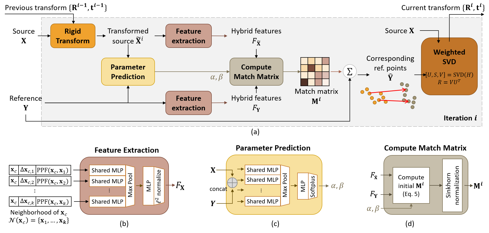
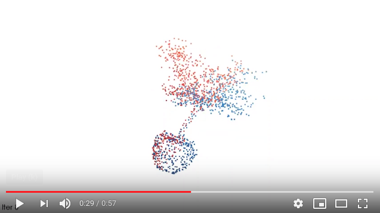

# RPM-Net: Robust Point Matching using Learned Features



This is the project webpage of our CVPR 2020 work. RPM-Net is a deep-learning approach designed for performing rigid partial-partial point cloud registration for objects in a iterative fashion. Our paper can be found on [Arxiv](https://arxiv.org/abs/2003.13479) ([supplementary](https://arxiv.org/src/2003.13479v1/anc/supplementary.pdf)).

```
@inproceedings{yew2020-RPMNet, 
    title={RPM-Net: Robust Point Matching using Learned Features}, 
    author={Yew, Zi Jian and Lee, Gim Hee}, 
    booktitle={Conference on Computer Vision and Pattern Recognition (CVPR)},
    year={2020} 
}
```

See the following link for a video demonstration of the results:

<a href="https://www.youtube.com/watch?v=7hxGmMk4MZ0">
    
</a>


## Prerequisites

See `requirements.txt` for required packages. Our source code was developed using Python 3.6 with PyTorch 1.2. However, we do not observe problems running on newer versions available as of time of writing.

## Training

Run the relevant commands below. We use the processed ModelNet40 dataset from [PointNet](https://github.com/charlesq34/pointnet) for this work, which will be automatically downloaded if necessary. Performance typically saturates by around 500-1000 epochs depending on setting.

```bash
mkdir rpmnet && cd rpmnet
git clone git@github.com:yewzijian/RPMNet.git
cd RPMNet/src
python train.py --noise_type crop
```

For clean and noisy data, we use a smaller batch size of 4 to allow it to train on a 11GB GPU (e.g. Nvidia GTX 1080Ti), but for the rest of the experiments we use a batch size of 8. So, for clean data, replace the last line with:

```bash
python train.py --noise_type clean --train_batch_size 4
```

, and for noisy data:

```bash
python train.py --noise_type jitter --train_batch_size 4
```

The tensorboard summaries and more importantly the checkpoints will be saved in `[root]/logs/[datetime]/*`. Note that you need a recent version of tensorboard if you wish to visualize the point clouds (optional).

## Inference / Evaluation

This script performs inference on the trained model, and computes evaluation metrics.

*Note: replace `--noise_type` accordingly if not running on partial data.*

```bash
python eval.py --noise_type crop --resume [path-to-logs/ckpt/model-best.pth]
```

Alternatively, given transforms saved in a .npy file of shape (B, [n_iter], 3, 4), you can evaluate them using:

```bash
python eval.py --noise_type crop --transform_file [path-to-transform-file.npy]
```

## Pretrained models

Our pretrained models can be downloaded from [here](https://drive.google.com/drive/folders/1CqbcyJ8cwIqTeuv6kRWsnUoYUY46ewb9?usp=sharing). You should be able to obtain the results shown in the paper by using these checkpoints.